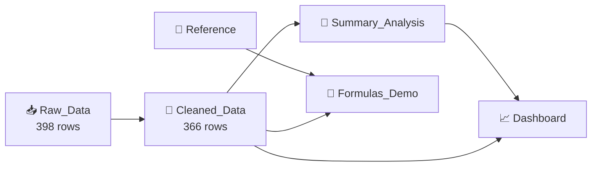

# 📊 Excel Interactive Sales Dashboard

### *From messy raw data to a clean, insight-driven dashboard — all inside Excel.*

---

## 🌟 Overview

This project is an **Excel Interactive Dashboard** built on a **synthetic retail-sales dataset** for the year **2024**. It walks through the complete analyst workflow, in six tasks:

> 📥 Import → 🧹 Clean → 📑 Summarize → 🧮 Formulas → 📈 Visualize → 🎛️ Interact

The dataset covers **5 regions**, **4 product categories**, **20 products** and **150 customers**, with orders from **1 Jan 2024 to 28 Dec 2024**.

---

## 🎯 Key Numbers

| 💰 Total Sales | 📈 Total Profit | 🧾 Total Orders | 🛒 Avg Order Value | 💹 Profit Margin |
|:---:|:---:|:---:|:---:|:---:|
| **$61,938.78** | **$13,582.36** | **366** | **$169.23** | **21.9%** |

---

## 🗂️ Workbook Structure

| # | Sheet | Task | What it does |
|:-:|-------|:----:|--------------|
| 1 | 📘 **Instructions** | — | Project guide and mapping of sheets to tasks |
| 2 | 🔎 **Reference** | — | Lookup tables: category margin % and region sales targets |
| 3 | 📥 **Raw_Data** | Task 1 | Dataset as imported: 398 rows, with duplicates and blanks on purpose |
| 4 | 🧹 **Cleaned_Data** | Task 2 | Deduplicated, missing values handled, types formatted (366 rows) |
| 5 | 📑 **Summary_Analysis** | Task 3 | Pivot-style tables by Region, Category and Month (SUMIFS / COUNTIFS) |
| 6 | 🧮 **Formulas_Demo** | Task 4 | VLOOKUP, INDEX-MATCH, nested IF, IFERROR |
| 7 | 📈 **Dashboard** | Task 5 & 6 | KPI cards, 3 charts, conditional formatting, region filter |

---

## 🧹 Data Cleaning

| Problem in Raw Data | Count | Fix Applied |
|---------------------|:-----:|-------------|
| 🔁 Duplicate rows | **17** | Removed |
| ❓ Missing Region | **10** | Rows handled / removed |
| ❓ Missing Customer Name | **5** | Rows handled / removed |
| 🔢 Inconsistent types | — | Dates, numbers and text formatted properly |
| 🗓️ No month field | — | Added **OrderMonth** column (e.g. `Jan-2024`) |

---

## 🧮 Formulas Used

| Formula | Where | Purpose |
|---------|-------|---------|
| `SUMIFS` | Summary_Analysis, Dashboard | Total sales and profit by region, category, month |
| `COUNTIFS` | Summary_Analysis, Dashboard | Order counts per group |
| `IFERROR` | Summary_Analysis, Formulas_Demo | Safe average order value and lookups |
| `VLOOKUP` | Formulas_Demo | Category → Margin % from Reference |
| `INDEX` + `MATCH` | Formulas_Demo | Region → Sales Target from Reference |
| Nested `IF` | Formulas_Demo | Order tier: **High** (> 150), **Medium** (> 75), **Low** |

---

## 🎛️ Dashboard Features

- 🟦 **KPI Cards:** Total Sales, Total Profit, Total Orders, Average Order Value
- 🔽 **Interactive Region Filter:** dropdown (`All / North / South / East / West / Central`) that updates filtered sales and orders instantly
- 📊 **Bar Chart:** Total Sales by Region
- 🥧 **Pie Chart:** Sales Share by Category
- 📉 **Line Chart:** Monthly Sales Trend for 2024
- 🎨 **Conditional Formatting:** highlights high and low values at a glance

---

## 💡 Key Insights

### 🌍 Sales by Region

| Region | Sales ($) | Profit ($) | Orders |
|--------|----------:|-----------:|-------:|
| 🥇 West | 13,643.61 | 3,005.55 | 79 |
| 🥈 North | 12,826.57 | 2,839.25 | 75 |
| 🥉 Central | 12,435.63 | 2,714.84 | 72 |
| South | 12,192.13 | 2,580.52 | 65 |
| East | 10,840.84 | 2,442.20 | 75 |

### 🛍️ Sales by Category

| Category | Sales ($) | Profit ($) | Profit Margin |
|----------|----------:|-----------:|:-------------:|
| 🪑 Furniture | 30,998.36 | 5,579.71 | 18.0% |
| 👕 Apparel | 16,612.64 | 3,654.82 | 22.0% |
| 💻 Electronics | 9,528.89 | 2,668.09 | 28.0% |
| ✏️ Stationery | 4,798.89 | 1,679.74 | 35.0% |

### ✨ Highlights

- 🏆 **Furniture drives 50% of all sales**, and **Study Desk** is the top product at **$12,306**.
- 💎 **Stationery has the best margin (35%)** but the smallest revenue share, so there is room to grow.
- 📅 **September 2024** was the best month (**$7,371**), followed by **February** and **June**.
- 🌟 **West** leads in sales, while **East** trails the other regions.

---

## 🚀 How to Use

1. **Download** `Manav_ExcelDashboard.xlsx`.
2. **Open** it in Microsoft Excel (2016 or newer recommended).
3. Start with the **Instructions** sheet, then move left to right through the tabs.
4. Go to the **Dashboard** sheet and change **Select Region** (cell `B7`) to filter the results.
5. Change the inputs in **Formulas_Demo** (`B4` and `B10`) to test the lookups.

---

## 🧰 Tools & Skills Demonstrated

`Data Cleaning` • `Data Validation` • `Excel Tables` • `SUMIFS / COUNTIFS` • `VLOOKUP` • `INDEX-MATCH` • `Nested IF` • `IFERROR` • `Charts` • `Conditional Formatting` • `KPI Design` • `Dashboard Design`

---

## 👨‍💻 Author
**Manav Patel**
📧 manavpatel.tech@gmail.com
🔗 [GitHub](https://github.com/techmanavp) 

